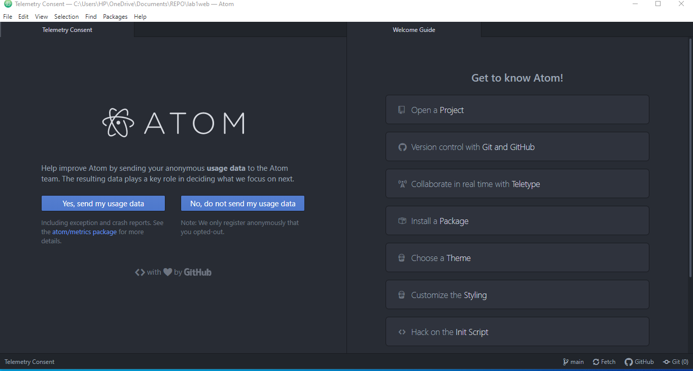
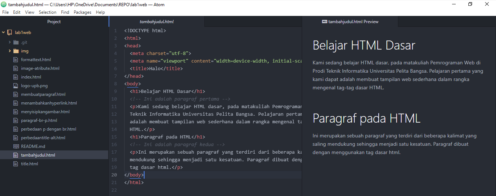
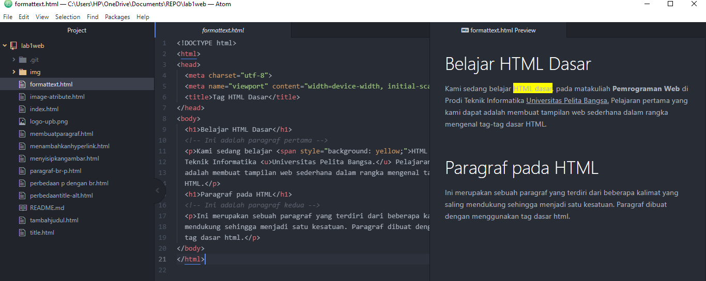
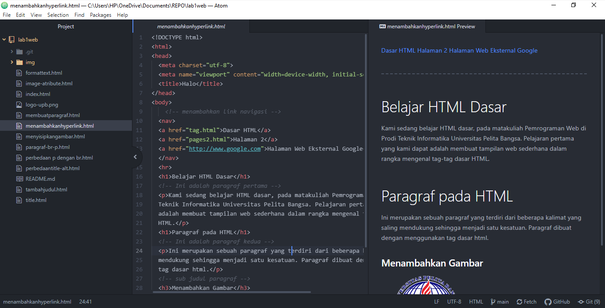
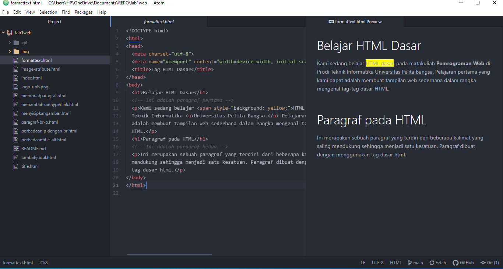
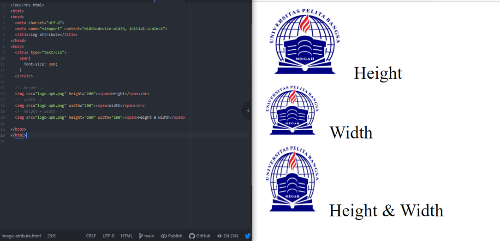

| Nama      | Fahmi Eko Putro Santoso |
| ----------- | ----------- |
| NIM     | 312010046       |
| Kelas   | TI.20.A1        |

## Langkah-langkah praktikum
Membuka text editor, disini saya menggunakan Atom

## 1. Membuat Paragraf

## 2. Menambahkan judul

## 3. Memformat text

## 4. Menyisipkan gambar

## 5. Menambahkan Hyperlink

## Jawab Pertanyaan Berikut
1. Lakukan perubahan pada kode sesuai dengan keinginan anda, amati perubahannya adakah
error ketika terjadi kesalahan penulisan tag?
2. Apa perbedaan dari tag `
` dengan tag ` `, berikan penjelasannya!
3. Apa perbedaan atribut title dan alt pada tag ``, berikan penjelasannya!
4. Untuk mengatur ukuran gambar, digunakan atribut width dan height. Agar tampilan gambar
proporsional sebaiknya kedua atribut tersebut diisi semua atau tidak? Berikan penjelasannya!
5. Pada link tambahkan atribut target dengan nilai atribut bervariasi ( _blank, _self, _top,
_parent ), apa yang terjadi pada masing-masing nilai antribut tersebut?

## Jawab
1. Saya akan melakukan perubahan pada tag html, gambar dibawah merupakan syntax HTML sebelum saya rubah

Lalu ketika saya hilangkan akhiran pada Tag `</h1>`menjadi `<h1>`, maka yang akan terjadi seluruh elemen dibawah tag tersebut akan berubah mengikuti Tag `<h1>` dikarenakan tidak ada akhiran/penutup Tag tersebut.
Seperti gambar dibawah

2. Tag ` ` berfungsi untuk melompati satu line, cocok untuk memulai paragraf baru, sedangkan tag `
` seperti menekan tombol enter di software document editor

3. Perbedaan atribut `title` dan `alt` yaitu pada gambar yang dihasilkan, ketika gambar berhasil ditampilkan maka akan terlihat sebuah title. Sedangkan jka gambar gagal ditampilkan maka akan menampilkan teks dalam atribut alt tersebut

4. Menurut saya lebih baik satu atribut saja agar aspek ratio gambar asli terjaga. Kecuali pada kondisi tertentu (seperti gambar yang sudah memiliki ukuran yg pas/proporsional) cukup mengatur width nya saja

5. `Nilai _blank` untuk membuka link di tab baru

	`Nilai _self` untuk membuka link/halaman ditab saat ini

	`Nilai _top` untuk membuka link/halaman dan membatalkan semua frame

	`Nilai _parent` untuk membuka link/halaman pada parent frame
